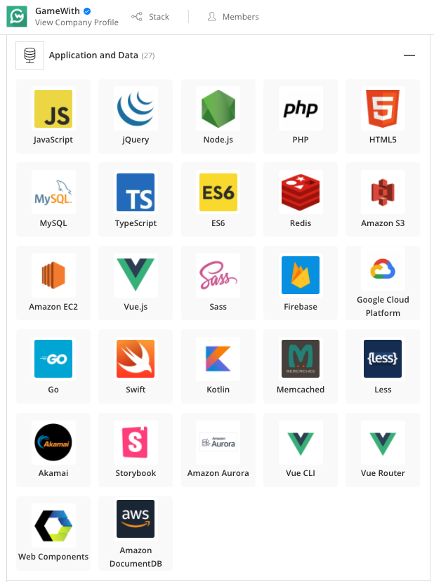

# GameWith Engineer Recruitment Repository

 

GameWith のエンジニア採用応募者向けの公開情報をまとめたリポジトリです。

## 現在募集中の職種

- [サーバサイドエンジニア](https://hrmos.co/pages/gamewith/jobs/1744966383630356502)

ご応募の際は必ず募集要項の内容をご確認ください。

カジュアル面談ご希望の方は [こちらの Wantedly ページ](https://www.wantedly.com/projects/606408) からお申し込みください。

## 採用技術
### GameWith

- サーバサイド：PHP, Go, (Python, Node.js)
- フロントエンド：TypeScript, ES6, jQuery, Vue.js, Web Components, LESS...
- クライアントサイド: Swift, Kotlin, Flutter (Dart), Unity (C#)
- データベース：MySQL, Aurora, DocumentDB, DynamoDB
- システムモニタリング：New Relic, Firebase Performance Monitoring
- 分析基盤：BigQuery, Google Analytics 4, Google Data Studio
- テスト：Autify
- インフラ
    - AWS（ALB, ECS Fargate, ElastiCache, S3, Lambda, CloudFront...）
    - GCP（Firebase, Cloud Firestore, Cloud Functions, Vision AI...）
    - Akamai（Image and Video Manager, Adaptive Media Delivery...）
    - Terraform

### AIM練習ソフト

- クライアントサイド: Unity (C#)
- サーバサイド：Go
- データベース：Aurora MySQL
- インフラ:
    - AWS（ALB, ECS Fargate, S3, Lambda, CloudFront...）
    - GS2（GameServiceService）主にユーザー管理系に利用

以下に[stackshare](https://stackshare.io/gamewith-inc/gamewith)から採用スタックを画像で引用しています。

    

        
    

## よくある質問
### 開発部の目標はどのようなものがありますか？

開発部の生産性を高めるチームや事業KPIにコミットするチームなど目的に応じてチーム分けされている中で各チームごとのステークホルダと調整して決めます。
いずれにしても開発部内だけで完結する目標を持つチームは少なく、より大きな組織への貢献を重視しています。

### 評価はどのように行っていますか？

半期ごとに個人目標の設定を行い、その達成度合いによって所属チームのリーダー、マネージャー、部長が評価を行っています。定期的な1on1の機会があるため、コミュニケーションによる齟齬は発生しづらくなっています。

### 残業時間はどのくらいですか？

平均すると月10~20時間くらいで、人によっては10時間以下の人もいます。忙しい月でも40時間程度が年に一回あるかないかくらいです。

完全裁量労働なので前後の月で残業が多かったりすると月によっては０以下のケースもあり、個々人の裁量で成果を出しています。また、長く働いた日が続いたら早めに上がるなどフレキシブルに勤務可能です。

ただし障害対応による深夜対応やゲームイベントなどによる休日出勤もありますがきちんと法定通りに手当が出ますし、時間帯や業務負荷など調整可能な体制が整っています。

### 社員はみんなヘビーゲーマーですか？

全員がヘビーゲーマーというわけではないです。ほとんどゲームをしない方や、ゲーム実況動画を見るだけの方、カジュアルにゲームやる方などいますが、ゲームを日常的にやる方は多いです。

社内でゲームを一緒にプレイするメンバーを募るDiscordサーバーがあるので、そこを通じて同じゲームをする仲間を見つけたりできます。

- [GameWith エンジニアの採用面接ガイド](https://github.com/GameWith/recruitment/blob/master/interview_guide_engineer.md)
- [GameWith エンジニアやサービス開発にまつわる記事](https://github.com/GameWith/recruitment/blob/master/articles.md)
- [GameWith の開発スタイル](https://github.com/GameWith/recruitment/blob/master/development_style.md)
- [Twitter - GameWith_Dev](https://twitter.com/gamewith_dev)
