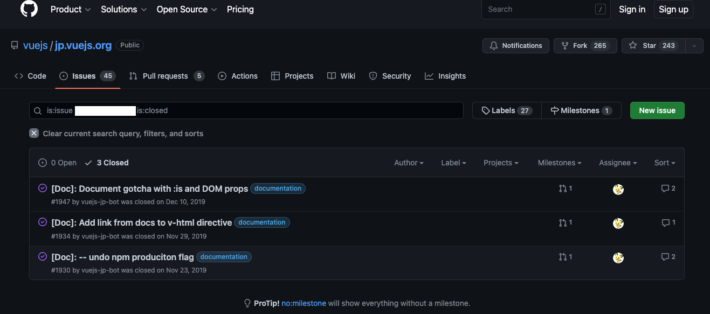

# 提供サービス

## GameWith 日本語版

iosアプリ

## GameWith英語版

    

## AIM練習ソフト

    

# GameWithの開発スタイル
## 技術スタック・ツール
サーバサイド言語として、主にPHPとGoを採用しています。
GameWithはFuelPHPというフレームワークを利用して開発されていますが、適切な粒度でのサービス分割、新規実装部分はGo+Vue.jsにて実装するケースも増えています。
最近ではスマホアプリや一部のwebにflutter を取り入れています。
### GameWith
- サーバサイド：PHP, Go, (Python, Node.js)
- フロントエンド：TypeScript, ES6, jQuery, Vue.js, Web Components, LESS...
- クライアントサイド: Swift, Kotlin, Flutter (Dart), Unity (C#)
- データベース：MySQL, Aurora, DocumentDB, DynamoDB
- システムモニタリング：New Relic, Firebase Performance Monitoring
- 分析基盤：BigQuery, Google Analytics 4, Google Data Studio
- テスト：Autify
### インフラ
- AWS（ALB, ECS Fargate, ElastiCache, S3, Lambda, CloudFront...）
- GCP（Firebase, Cloud Firestore, Cloud Functions, Vision AI...）
- Akamai（Image and Video Manager, Adaptive Media Delivery...）
- Terraform
### AIM練習ソフト
- クライアントサイド: Unity (C#)
- サーバサイド：Go
- データベース：Aurora MySQL
- インフラ: 
  - AWS（ALB, ECS Fargate, S3, Lambda, CloudFront...）
  - GS2（GameServiceService）主にユーザー管理系に利用
  - GameWithを構成する周辺システムについて

## GameWithを構成する周辺システムについて
GameWithはさまざまなマイクロサービスや独自ライブラリなどで構成されています。
より良いサービスをユーザーに提供するためにシステムも日々進化しています。
数が多いので一部を抜粋して紹介します。

### GameWithDesignSystem

GameWith Developer Blog 「GameWithのリプレイスについて vol.2」 より
### 記事下コメントシステム
GameWithの各種記事に書き込みできるコメントを管理するシステムです。

バックエンドはgolang、フロントエンドはGameWithDesignSystem（Vue.js/TypeScript）を利用しています。
会員登録せずとも書き込みができる仕様になっているため、トラフィックの多いGameWithでもユーザーが快適に利用できるようにフロントエンドでの非同期描画やCDNの利用などの工夫をしています。
### GO最新攻略 & レイド招待・個体値チェッカー

GameWith Developer Blog 「社内でFlutterを採用しアプリと管理画面を開発した話」より
# 開発プロセス 

## プロジェクトの進み方

チームごとにワークフローを決めて動いているため細かな違いがありますが、以下の部分は共通しています。
- 1週間を1スプリントとしたアジャイル開発
- 1日1回ビデオ通話による朝会（デイリースクラムのようなもの）を実施

また、チームや仕事内容によって度合いは変わりますが各事業部とも仕様の相談・調整を随時行っています。開発部が主体的にビジネス視点での改善や施策を提案しコミットすることを強く推奨しており、ビジネス側もそれを受け入れる風土があります。
## 各種管理
コミュニケーションツールとして slack、 チームのタスク管理にはZenHub、ドキュメント管理にはNotionを利用しており、**フルリモートワーク体制でも滞りなく業務が遂行できる**ツールを積極的に導入しています。

ZenHubのカンバンボード
## 日常的にリリースを行う
現在の月間リリース数は80前後。平均すると1日に4〜5回リリースが行われている計算になります。

GameWithではユーザに価値を素早く届けることを重視しており、ビッグバンリリースよりも小さなリリースを日常的に行うのが良しとされています。
## 組織体制
サービス開発部では約25名のメンバーが在籍しています。

事業に沿ったチームと、それを横断的にサポートするチームが存在します。

定期的に情報共有会を開催したり、一部のメンバーは複数のチームを兼務していたりとチーム間連携も活発に行われています。

ロールとしてはリーダー/ディレクター/エンジニアというメンバーでチームが構成されています。
開発チームの年齢は26歳~42歳のレンジで構成されており、ボリュームゾーンは30代前半です。他にも、以下のような多様性のあるチームです。
- 育児中のエンジニアリーダー・マネージャー がいる
- 女性エンジニア がいる
- 外国籍エンジニア がいる
- ディレクター経験のあるエンジニア がいる

# エンジニアから見たGameWithの面白さ
## ハイトラフィックなサービスの開発運用
月間5億PV、4500万UUが利用するサービスのため、自らリリースした施策への反応がすぐに返ってきます。秒間リクエスト数まで意識をして設計や実装を行う必要があるため、エンジニアとしてのスキルが磨かれます。

## いちゲームユーザーとしての視点が活かせる
2020年〜の巣ごもり需要により、ゲーム業界全体の市場規模が大きく伸長しています。その中で攻略メディアビジネスも競争が激化しており、差別化やメディアとしてさらなる品質向上が重要になってきています。

そのため、いかに素早くユーザのニーズに応えられるようなサービスを提供し続けることができるかが今後の成長の鍵となります。
技術力だけでなく業界のトレンドやいま流行しているゲームについてのキャッチアップも同時に求められ、とても刺激的な環境です。

## あらゆるステークホルダを支える屋台骨
GameWithを開発するエンジニアにとって、少なくとも3つのステークホルダが存在すると考えています。

まず１つにゲームを楽しむエンドユーザーです。品質の高い情報をいち早くユーザーに届け、ユーザーのゲームプレイをより快適にすることが求められます。

次にゲームを売り出すパブリッシャーやデベロッパーです。発売されたゲームをより楽しんでもらうこと、ゲームの魅力をより多くのユーザーに届けることでさらなるゲーム業界の発展に寄与していきます。

最後にGameWithでゲームの記事を書くライターです。ダッシュボードを常に改善し続けることで彼らがより効率的に良い記事をリリースし続けることを目ざいます。

このような多様なステークホルダが満足するようにエンジニアリングの観点から最善を尽くしています。
## GameWith開発部が目指す組織の姿
### ボトムアップでのシステム改善・施策提案の実施
コンテンツだけではなくサービスとして、より良い価値提供をユーザに行えるような組織体制を目指しています。
解像度高くサービスのことを理解しているエンジニアだからこそできる施策やシステム改善などを積極的に実現できるよう仕組みやカルチャーをつくっています。

### 提案ボード
数値分析によるファクトベースでの施策立案
施策立案をする際には、どのKPIに対して影響があるかを考えます。実際にリリースしたあとに結果はどうだったかを振り返る場をつくるようにしています。
数値分析グループでは週次での定期レポーティング会を行っており、エンジニアもサービス全体の数値把握をおこなう機会があります。

### 開発効率の改善
2013年にGameWithがリリースされ、以来多くの機能開発を行ってきました。コードベースや組織の拡大に伴うスピード低下を避けるために課題をひとつずつクリアし、あらゆる面から効率向上のための取り組みをおこなっています。
機動的なペアプロ、モブワークの実践
設計・コード・セキュリティレビューの実施
E2Eテスト自動化によるテスト工数圧縮
不要コードの削減
# カルチャー
## 業務アピール会・社内LT会
毎月おこなわれるサービス開発部の全体会のコンテンツのひとつとして、業務に対する個人のこだわりポイントを話してもらう業務アピール会というものを実施しています。
また、毎週金曜日の業務時間終了後に任意参加の社内LT会が開催されています。ここでは、最近気になった技術やトピックなどを自由に発表しています。

## 互いに感謝・称賛するカルチャー
Slack上で ピアボーナスのシステムである HeyTaco を採用しています。
これはタコスの絵文字で感謝を手軽に表現することでインセンティブを付与できるシステムです。
タコスを集めるとガチャを引き、iTunes/Google Playカードを手に入れることができます。

## 積極的なスキルアップ支援
エンジニアのスキルアップの支援として以下の手当や取り組みを行っています

### 技術勉強手当
業務時間外に月10時間以上の取り組みをした場合に支給されます

基本的にはアウトプットが残る形を推奨しています

- コードがあるものはgithubのリポジトリ公開
- 読書をしたものは内容のサマリをブログで公開
etc…

### OSSコントリビュータ / コミッタ手当
GitHub の場合、スター数が一定以上のOSSに対してIssueの起票やPullRequestのマージを一定以上行うことによって支給されます

ハードルが高い分、半年程度継続して手当が支給されます

### テックブログの執筆
社内でテックブログ推進委員がおり、ブログ作成に不安がある人も安心して書くことが出来ます

ブログを記載することはエンジニアのスキル向上に役に立つと捉えており、業務時間を使ってブログ執筆も可能です

# appendix
- [GameWith エンジニアの採用面接ガイド](https://github.com/GameWith/recruitment/blob/master/interview_guide_engineer.md)
- [GameWith エンジニアやサービス開発にまつわる記事](https://github.com/GameWith/recruitment/blob/master/articles.md)
- [Twitter - GameWith_Dev](https://twitter.com/gamewith_dev)
